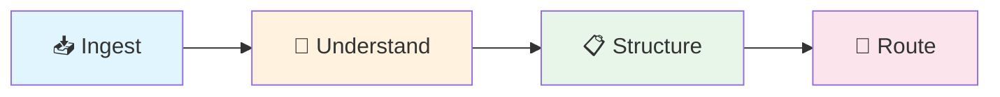
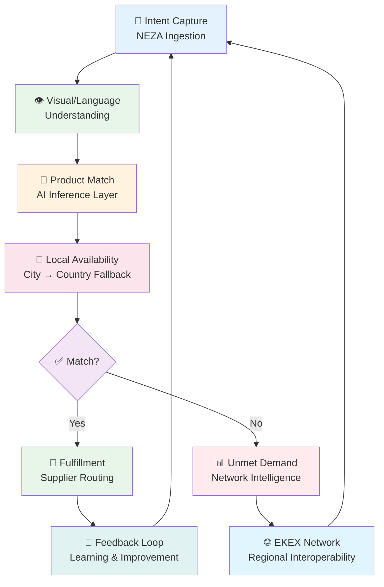

<div align="center">

# 🧠 EKEX INTELLIGENCE

### Open Intent Intelligence Infrastructure for Local Commerce

[](https://www.gnu.org/licenses/agpl-3.0)
[]()
[]()
[]()
[]()
[]()

**[🏠 EKEXintelligence.com](https://EKEXintelligence.com)** · **[📚 Documentation](https://docs.ekexintelligence.com)** · **[🔌 API Reference](https://api.ekexintelligence.com)** · **[🐛 Report Issue](https://github.com/ekexintelligence/ekex-core/issues)**

**📧 All Inquiries:** [info@ekexintelligence.com](mailto:info@ekexintelligence.com)

</div>

---

## 📑 Table of Contents

- [🎯 What is EKEX Intelligence?](#what-is-ekex-intelligence)
- [👁️ NEZA: The Visual Intent Engine](#neza-the-visual-intent-engine)
- [🔄 The Core Loop](#the-core-loop)
- [🏗️ Repository Architecture](#repository-architecture)
- [⚡ Core Capabilities](#core-capabilities)
- [🛠️ Technology Stack](#technology-stack)
- [🚀 Getting Started](#getting-started)
- [⚖️ AGPL-3.0 Compliance Notice](#agpl-30-compliance-notice)
- [🤝 Contributing](#contributing)
- [🔒 Security](#security)
- [📞 Support](#support)
- [👥 About](#about)

---

## 🎯 What is EKEX Intelligence?

**EKEX Intelligence** is a **self-hostable, open-source** commerce intelligence infrastructure. It transforms how local markets match demand to supply by understanding *what people want* — especially when they **show**, not just tell.

### 🌍 The Problem

Informal African markets run on intent expressed through scattered channels: WhatsApp forwards, Telegram messages, voice notes, and photos. Suppliers operate blind to aggregate demand. EKEX bridges this gap **not** by building another marketplace, but by making intent *understandable* and *actionable* as **open infrastructure**.

### 🎯 Our Mission

> *"To build the foundational data infrastructure that enables African businesses to anticipate demand, optimize supply, and capture market opportunities that would otherwise remain invisible."*

### 📊 Current Operational Scope

| Metric | Status | Detail |
|---|---|---|
| 🏠 **Primary Market** | Kigali, Rwanda | Live operations |
| 🚀 **Expansion Pipeline** | Nairobi, Kenya · Kampala, Uganda | Q3-Q4 2026 |
| 👥 **Active Consumers** | 4+ real users | Submitting live signals |
| 🏭 **Verified Suppliers** | 6+ active | Across Rwanda & Uganda |
| 📡 **Signal Volume** | 14+ demand signals | Captured and processed |
| 👗 **Product Categories** | Fashion/Apparel | Primary vertical |
| 🤖 **Telegram Bot** | NEZA | Live (timeout fix pending) |

---

## 👁️ NEZA: The Visual Intent Engine

**NEZA** is the **multimodal intent intelligence layer** at the heart of EKEX. It processes a single input — an image, a voice note, a WhatsApp message, or a Telegram text — and extracts structured intent: product, attributes, quality, style, and urgency. When an image is present, NEZA treats it as the **highest-confidence signal**.

### 🔄 How NEZA Works



| Stage | Action | Output |
|---|---|---|
| **📥 Ingest** | Captures input from any channel | Raw signal (image, text, voice, WhatsApp, Telegram) |
| **🧠 Understand** | Extracts intent: product recognition, attribute parsing | Structured intent with confidence scores |
| **📋 Structure** | Formalizes intent into `DemandObject` | Standardized demand signal |
| **🚀 Route** | Hands to AI inference layer | Match-ready structured intent |

> **💡 NEZA is not a chatbot.** It is an intent engine that happens to speak through messaging channels.

---

## 🔄 The Core Loop



### 🔢 Loop Steps

| # | Stage | Layer | Description |
|---|---|---|---|
| 1 | **🎯 Intent Capture** | NEZA | Ingests multimodal signals: image, text, voice, WhatsApp, Telegram |
| 2 | **👁️ Visual/Language Understanding** | NEZA | Extracts intent: product recognition, attribute parsing (material, quality, category, style) |
| 3 | **🔗 Product Match** | AI Inference | Matches intent against structured supply data via embedding & similarity scoring |
| 4 | **📍 Local Availability** | EKEX | Location-weighted matching: city → country fallback verifies stock proximity |
| 5a | **🚚 Fulfillment** | EKEX | Routes to supplier if matched |
| 5b | **📊 Unmet Demand** | EKEX | Flags unmatched intent for network intelligence aggregation |
| 6 | **🌐 EKEX Network Routing** | EKEX | Aggregates unmet demand, routes signals to supplier networks, enables regional interoperability |

---

## 🏗️ Repository Architecture

```
📦 EKEX INTELLIGENCE — REPOSITORY MAP
═══════════════════════════════════════════════════════════════════════════════

🌐 PUBLIC REPOSITORY — GNU AGPLv3
│
├── 📁 src/
│   ├── 📁 neza/                   🤖 NEZA intent engine (multimodal input processing)
│   │   ├── 📁 signal-ingestion/   📥 Voice, image, text, WhatsApp, Telegram capture
│   │   ├── 📁 visual-intent/      👁️ Image-based product recognition & attribute extraction
│   │   └── 📁 intent-structurer/  📋 DemandObject formalization
│   │
│   ├── 📁 inference/              🧠 AI inference layer
│   │   ├── 📁 embedding/          🔢 Product + intent vectorization
│   │   ├── 📁 matching/           🔗 Similarity scoring & probabilistic match
│   │   └── 📁 ranking/            📊 Price, quality, similarity, preference fit ranking
│   │
│   ├── 📁 ekex/                   🌐 EKEX intelligence infrastructure
│   │   ├── 📁 network-routing/    🚀 Supplier network signal distribution
│   │   ├── 📁 demand-aggregation/ 📊 Unmet demand pooling & regional interoperability
│   │   ├── 📁 availability/       📍 Local stock verification & fallback logic
│   │   └── 📁 feedback/           🔄 Fulfillment outcome learning loop
│   │
│   ├── 📁 api/                    🔌 REST/GraphQL endpoints
│   ├── 📁 models/                 🗄️ Database schemas (DemandObject, SupplyObject, etc.)
│   └── 📁 config/                 ⚙️ Environment & deployment templates
│
├── 📁 docs/                       📚 Public documentation
│   ├── 📁 architecture/
│   ├── 📁 neza/
│   ├── 📁 apis/
│   ├── 📁 deployment/
│   ├── 📁 intelligence-systems/
│   ├── 📁 supplier-network/
│   ├── 📁 onboarding/
│   └── 📁 legal/
│
├── 📁 tests/                      🧪 Test suites & fixtures
├── 📁 scripts/                    🛠️ Deployment & utility scripts
├── 📁 data/                       📊 Sample data & schema definitions
│
├── 📄 .env.example                🔑 Environment variable template
├── 📄 docker-compose.yml          🐳 Local development orchestration
├── 📄 Dockerfile                  📦 Container build template
├── 📄 README.md                   📖 This file
├── 📄 CONTRIBUTING.md             🤝 Contribution guidelines
├── 📄 LICENSE                     📜 GNU AGPLv3 + EKEX Network Service Amendments
└── 📄 .gitignore                  🔒 Privacy & security protections

═══════════════════════════════════════════════════════════════════════════════
```

---

## ⚡ Core Capabilities

### 🤖 NEZA Intent Engine

| Capability | Status | Detail |
|---|---|---|
| 📥 **Multimodal ingestion** | ✅ Live | Image, text, voice, WhatsApp, Telegram |
| 👁️ **Visual intent extraction** | ✅ Live | Product recognition, material detection, quality assessment, style classification |
| 🗣️ **Language understanding** | ✅ Live | Attribute parsing, urgency detection, preference inference |
| 🔄 **Signal deduplication** | ✅ Live | 5-gate logic: technical duplicate, return-after-match, genuine re-submission, velocity flood, default |

### 🧠 AI Inference Layer

| Capability | Status | Detail |
|---|---|---|
| 🔢 **Embedding & vectorization** | ✅ Live | Product + intent semantic representation |
| 🔗 **Probabilistic matching** | ✅ Live | Similarity scoring with confidence thresholds |
| 📊 **Ranking engine** | 🔄 In Progress | Price, quality, similarity, preference-fit ranking |
| 📍 **Location-weighted fallback** | ✅ Live | City → country availability tiers |

### 🌐 EKEX Intelligence Layer

| Capability | Status | Detail |
|---|---|---|
| 📍 **Local availability matching** | ✅ Live | Real-time stock proximity verification |
| 📊 **Unmet demand detection** | 🔄 In Progress | Classification of unmatched intent for network intelligence |
| 🚀 **Supplier network routing** | ✅ Live | Signal distribution to verified supplier pools |
| 🌍 **Regional interoperability** | 🔄 In Progress | Cross-city, cross-country demand aggregation |
| 🔄 **Feedback learning** | 🔄 In Progress | Temporal decay, confidence adjustment, recursive improvement |

---

## 🛠️ Technology Stack

| Layer | Technology | Status |
|---|---|---|
| 🎨 **Frontend** | React / Next.js (Mobile-responsive, dark theme) | ✅ Production |
| 🔌 **Backend API** | Node.js / Express / GraphQL | ✅ Production |
| 🗄️ **Database** | PostgreSQL + Redis (caching layer) | ✅ Production |
| 🧠 **AI/ML** | AI inference layer (embedding + matching engine) | ✅ Production |
| 💬 **Messaging** | Telegram Bot API, WhatsApp Business API | ✅ Live |
| 🐳 **Containerization** | Docker + Docker Compose | ✅ Ready |
| ☁️ **Cloud** | Multi-cloud ready, self-hostable by default | ✅ Ready |

---

## 🚀 Getting Started

### 📋 Prerequisites

| Requirement | Version | Optional |
|---|---|---|
| Node.js | 18+ | ❌ Required |
| Docker & Docker Compose | Latest | ✅ Recommended |
| Git | Latest | ❌ Required |
| PostgreSQL | 14+ | ✅ Or use Docker |
| Redis | 7+ | ✅ Or use Docker |

### 🏃 Quick Start

```bash
# 1️⃣ Clone the Repository
git clone https://github.com/ekexintelligence/ekex-core.git
cd ekex-core

# 2️⃣ Configure Environment
cp .env.example .env.local
# ✏️ Edit .env.local — NEVER commit this file

# 3️⃣ Install & Start
npm install
docker-compose up -d db redis
npm run db:migrate
npm run db:seed
npm run dev
```

### 🌐 Access Points

| Service | URL | Description |
|---|---|---|
| **API** | `http://localhost:3000` | REST/GraphQL endpoints |
| **Admin Dashboard** | `http://localhost:3000/admin` | Management interface |

### 🧪 Run Tests

```bash
# All tests
npm test

# Unit tests only
npm run test:unit

# Integration tests
npm run test:integration

# With coverage
npm run test:coverage
```

---

## ⚖️ AGPL-3.0 Compliance Notice

<div align="center">

[](https://www.gnu.org/licenses/agpl-3.0)
[]()

</div>

This repository is **free software** licensed under the **GNU Affero General Public License v3.0**.

### 🌐 Network Service Obligations

If you deploy EKEX Intelligence as a network service (SaaS, API, bot, or any remote user interaction), you **must** offer all users the **Corresponding Source** of your deployed version, including all modifications.

### 📋 What This Means

| Scenario | Obligation |
|---|---|
| **Unmodified deployments** | Still require source offer mechanism |
| **Modified deployments** | All modifications must be released under AGPL-3.0 |
| **API wrappers & shims** | Proprietary wrappers do **NOT** exempt source disclosure |
| **White-label deployments** | Every end user interface must contain the source offer |

### 🚫 No Proprietary Sublicensing

EKEX Intelligence is licensed under **AGPL-3.0 only**. No proprietary sublicensing, commercial licenses, or closed-source distribution rights are granted for any code in this repository. Revenue may be generated through **AGPL-3.0-compliant services**: consulting, support, hosting, and deployment assistance.

📜 **Full license text:** [LICENSE](LICENSE)

---

## 🤝 Contributing

We welcome contributions from the **African developer community** and global open-source ecosystem. Please read [CONTRIBUTING.md](CONTRIBUTING.md) for guidelines and our **Developer Certificate of Origin (DCO)** process.

### 🎯 Priority Areas

| Priority | Area | Impact | Skills |
|---|---|---|---|
| 🔴 **P0** | Visual intent engine accuracy | Reduce 28% "Unknown" classification rate | ML, Computer Vision |
| 🔴 **P0** | End-to-end matching verification | Diagnose zero ProductMatch records | Debugging, SQL |
| 🟡 **P1** | Confidence scoring calibration | Replace hardcoded `intent_score = 1` | Statistics, ML |
| 🟡 **P1** | Local dev environment | Reproducible setup in <30 minutes | Docker, DevOps |
| 🟢 **P2** | Protocol RFCs | Architecture documentation | Technical Writing |

---

## 🔒 Security

| Channel | Contact | Purpose |
|---|---|---|
| 📧 **Security Issues** | [info@ekexintelligence.com](mailto:info@ekexintelligence.com) | Vulnerability reports |

> ⚠️ **Do NOT open public issues for security vulnerabilities.**

### 🔐 Security Measures

- ✅ Environment files protected by `.gitignore`
- ✅ API rate limiting enabled by default
- ✅ Parameterized database queries
- ✅ Input validation at all entry points

---

## 📞 Support

<div align="center">

**🏠 Official Website:** [EKEXintelligence.com](https://EKEXintelligence.com)  
**📧 All Inquiries:** [info@ekexintelligence.com](mailto:info@ekexintelligence.com)

</div>

| Channel | Contact | Purpose |
|---|---|---|
| 📧 **General Inquiries** | [info@ekexintelligence.com](mailto:info@ekexintelligence.com) | All questions |
| 📧 **Security Issues** | [info@ekexintelligence.com](mailto:info@ekexintelligence.com) | Vulnerability reports |
| 📧 **Legal Matters** | [info@ekexintelligence.com](mailto:info@ekexintelligence.com) | Licensing & legal |
| 📧 **Contributors** | [info@ekexintelligence.com](mailto:info@ekexintelligence.com) | Contribution questions |
| 🐛 **GitHub Issues** | [github.com/ekexintelligence/ekex-core/issues](https://github.com/ekexintelligence/ekex-core/issues) | Bug reports & features |

---

## 👥 About

<div align="center">

### 🏛️ Kimuntu Group

**EKEX Intelligence** is maintained by **Kimuntu Group**, founded **16 March 2026** by **Kayembe Ilunga Eddy-Grant**.

</div>

### 👤 Co-Founders & Contributors

| Name | Role | Status |
|---|---|---|
| **Kayembe Ilunga Eddy-Grant** | Founder and Head of the Board | 🟢 Active |
| **Stephane Bilambo** | Early co-founder contributor; Angel (4.5% equity, non-vesting); Consultant | 🟢 Active |
| **Goetz Kisoni** | Co-Founder, Board Member, and CEO | 🟢 Active |

<div align="center">

**📧 All Inquiries:** [info@ekexintelligence.com](mailto:info@ekexintelligence.com)  
**🏠 Official:** [EKEXintelligence.com](https://EKEXintelligence.com)

> *"We are not asking you to believe the white paper. We are asking you to help us make it true."*  
> — Kimuntu Group, 2026

</div>

---

<div align="center">

**[🏠 EKEXintelligence.com](https://EKEXintelligence.com)** · **[📚 Documentation](https://docs.ekexintelligence.com)** · **[👥 Kimuntu Group](https://kimuntugroup.com)**

*© 2026 Kimuntu Group. Licensed under GNU AGPLv3.*

</div>
